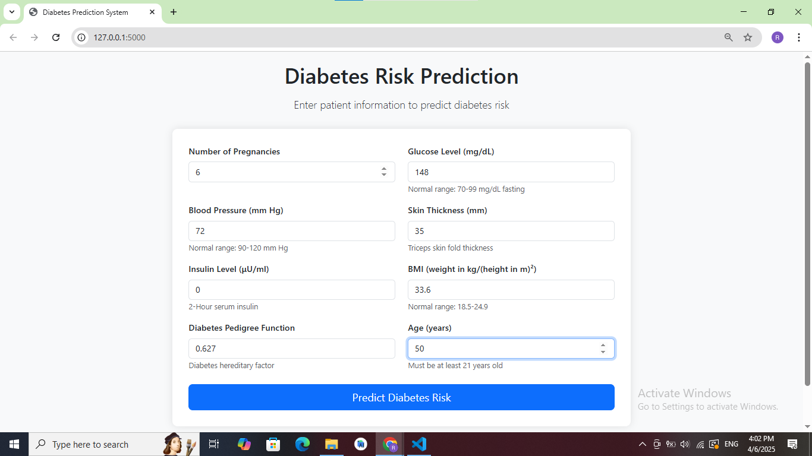
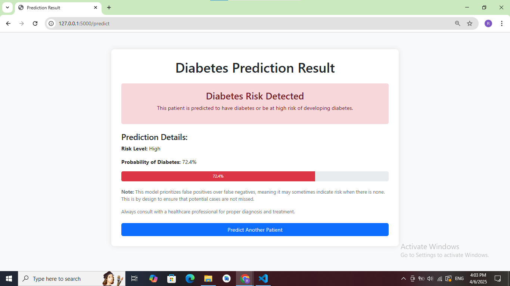
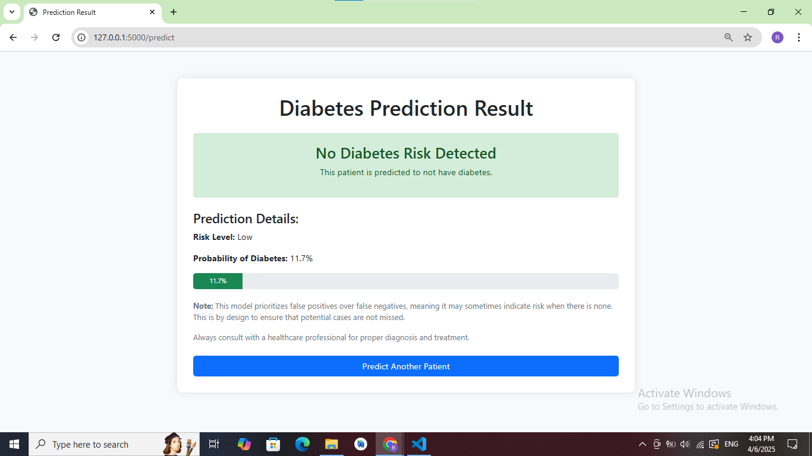

# Diabetes Prediction Web Application

A Flask-based web application for predicting diabetes risk using machine learning. This project was developed as part of a machine learning course assignment.






## Project Overview

This application uses a machine learning model trained on the Pima Indians Diabetes Dataset to predict whether a patient has diabetes based on various medical indicators. The model is specifically designed to maintain a higher false positive than false negative rate, ensuring potential diabetes cases are not missed.

### Features

- **User-friendly web interface** for entering patient data
- **Real-time predictions** based on a trained machine learning model
- **Detailed results** showing risk level and probability
- **Responsive design** that works on both desktop and mobile devices
- **Comprehensive data preprocessing** to ensure accurate predictions

## Dataset

The dataset used for training the model is from the National Institute of Diabetes and Digestive and Kidney Diseases. It includes data from females at least 21 years old of Pima Indian heritage. The features include:

- Number of pregnancies
- Glucose concentration
- Blood pressure
- Skin thickness
- Insulin level
- BMI
- Diabetes pedigree function
- Age

## Machine Learning Model

The model was developed using a rigorous machine learning pipeline:

1. **Data Exploration and Analysis** - Understanding feature distributions and correlations
2. **Data Preprocessing** - Handling missing values and creating derived features
3. **Model Training** - Testing multiple algorithms with a focus on false positive/negative balance
4. **Model Evaluation** - Using metrics relevant to medical prediction tasks
5. **Model Optimization** - Fine-tuning parameters to achieve the desired FP > FN ratio

## Installation and Setup

### Prerequisites

- Python 3.7+
- pip package manager

## Usage

1. Enter patient data in the form fields
2. Click the "Predict Diabetes Risk" button
3. View the prediction results, including:
   - Binary prediction (Diabetes/No Diabetes)
   - Risk level (Low/Medium/High)
   - Probability percentage

## Project Structure

```
diabetes_prediction_app/
├── app.py                      # Main Flask application
├── diabetes_prediction_model.pkl  # Trained machine learning model
├── templates/                  # HTML templates
│   ├── index.html              # Input form
│   ├── result.html             # Results display
│   └── error.html              # Error handling
├── static/                     # Static assets (optional)
├── requirements.txt            # Project dependencies
└── README.md                   # Project documentation
```

Key metrics:
- Accuracy: ~77%
- ROC AUC Score: ~0.85


## Acknowledgments

- National Institute of Diabetes and Digestive and Kidney Diseases for the dataset
- All contributors to the scikit-learn, pandas, and Flask libraries
- Course instructors for their guidance and support

## Disclaimer

This application is intended for educational purposes only. The predictions should not be used for actual medical diagnosis. Always consult with a healthcare professional for proper diagnosis and treatment of diabetes or any other medical condition.
